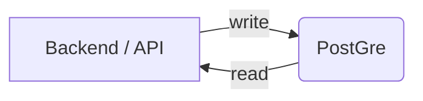

# Coding challenge

This project contains a simple CRUD functionality for group entities which are available after using a basic JWT authentication based on Spring security.

## How to start up project
To start the project, you need to have docker installed on your host. There are no other requirements.

```shell
docker compose up
```
## Available endpoints

* \GET https://localhost:8080/health
* \POST https://localhost:8080/auth/login
* \POST https://localhost:8080/auth/register
* \POST & \GET https://localhost:8080/groups{/(id)}

### Note
The group endpoints are only available if you authenticate using the login endpoint.

<b>First, register a new account:</b>
```shell
curl -X POST \
	http://localhost:8080/auth/register \
	-H 'Content-Type: application/json' \
	-d '{ "email": "test@gmail.com", "password": "test1234", "firstName": "F","lastName": "L" }'
```
<b>Then login:</b>
```shell
curl -X POST \
  http://localhost:8080/auth/login \
  -H 'Content-Type: application/json' \
  -d '{	"email": "test@gmail.com",	"password": "test1234"}'
```
This will return a token which you can use as Authentication Bearer token:

```shell
curl -X GET \
  http://localhost:8080/groups \
  -H "Authorization: Bearer $TOKEN"

```

## Infrastructure


